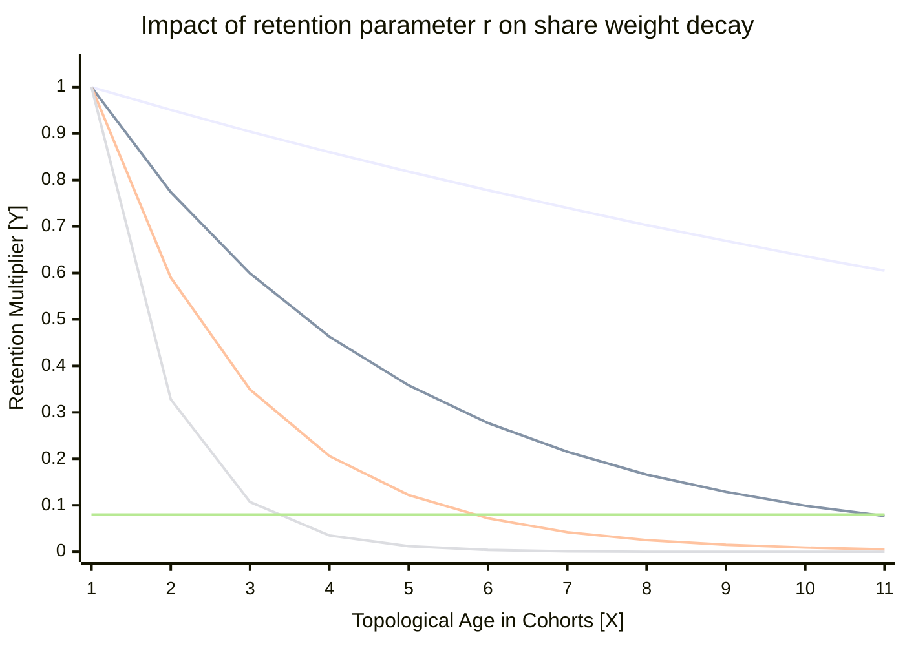

# EDCA: Mining Payouts in DAG Consensus

Author: **Mohd Zaid**  

---

### Abstract

The current Bitcoin mining ecosystem is mostly centralized occupying over 80% centralization risk due to economic and structural limitations of the existing mining pool protocols. Although some of the efforts from mining pools are shown to tackle the problem, but all of them are built upon the idea of linear-chain (single block-like structure) and written as the perspective of a centralized authority (one pool handling all the internal processes). Previous attempts also face orphan penalties, chain bloats, and fee-based pool hopping. This proposal outlines a peer-to-peer, censorship-resistant payout protocol for DAG based mining pools. This uses an Exponentially Decayed Cohort Average (EDCA) payout scheme combined with a dynamic Fee Amplifier over Directed Acyclic Graph (DAG). Mathematically this eliminates both time-based and fee-based pool hopping. And ensures full Expected Value (EV) of solo mining while minimizing variance to the absolute theoretical limit achievable under decentralized consensus.

---

## 1. INTRODUCTION

In a pure decentralization network each participating node maintains equal, independent authority over block generations according to its contribution percentage to the system; it can be in terms of number of nodes or hash rate. Additionally, transparency in the network auditing system is also an important factor, which includes how shares are being computed and stored, on what basis shares are getting rejected by the network, and what the overall general consensus of the network is. In a decentralized payout system, a single node is not solely responsible for calculating only their percentage of shares but also verifies the shares received from others and then propagates them. This creates a game theory perspective of mining. So a network can decide based on some internal, agreed-upon consensus to calculate payouts and distribute funds according to the amount of work everyone has done. However, due to high variance in the block, finding many miners choose to point their hash rate to centralized mining pools to maintain a steady and predictable revenue or prevent them from bearing huge losses due to electricity or any other economic factor.

With that, today's Bitcoin mining ecosystem is highly consolidated, where a handful of pool operators are controlling more than 80% of the network hash rate [1]. As most of the centralized pools construct the block templates and calculate the payouts on behalf of their miners. This allows them the power to censor transactions, reorg the chain, temper payouts or succumb to regulatory capture.

The most effective defence from this is a peer-to-peer, decentralized mining pool where early attempts at this architecture, most notably P2Pool [6], proved that decentralized pooling is mathematically possible. However, they failed to achieve mass adoption due to network and game-theoretic flaws. Because legacy decentralized pools relied on linear "sharechain" to track miner contributions, they suffered from chain bloat, high orphan rates and inaccurate Expected Value (EV). Miners operating outside the major geographic hubs were getting penalized by network latency, leading to inefficient mining and resources.

Furthermore, traditional payout mechanisms like Pay-Per-Last-N-Shares (PPLNS) fail to hold up in a decentralized environment. The chances of pool-hopping (where mines abandon the pool during long rounds of finding a block) and fee-sniping (where miners leech off the pool's steady payouts but switch out to other pools when mempool fees spike [7]) are very high here.

To solve the geographic latency problem, this protocol abandons the idea of a linear share chain in favour of an asynchronous Directed Acyclic Graph (DAG) data structure, utilizing the Braid consensus model [2]. The DAG topology successfully eliminates the orphan rate penalties but introduces a complex secondary problem: how does a network calculate fair, tamper-proof, and memory-efficient payouts on an asynchronous graph without relying on a central server or vulnerable wall-clock timestamps?

This paper answers that question by introducing the "Exponentially Decayed Cohort Average" (EDCA). We propose a consensus-level payout architecture designed explicitly for DAG-based mining pools. By doing reward calculations to topological graph cuts rather than linear time, dynamically amplifying share weights according to the current mempool state, and mathematically bounding the state memory to $O(1)$, this protocol completely neutralizes the above mentioned problems.

---

## 2. Theoretical Foundation

The architecture is built upon three theoretical foundations which are designed to correct the game-theory failures of legacy mining pools. By shifting from linear sharechain to a topological DAG, the protocol enables a mathematical workflow that enforces loyalty between participating nodes and accurate work calculation without relying on centralized coordination.

### 2.1 The DAG, Beads, and Graph Cuts

In the traditional approach if two miners find a share simultaneously, the network forks, and one share is orphaned, which punishes one of the miner work. The latency advantage can be here due to geographical location or unstable connection or any other reason. While a pool utilizing the Directed Acyclic Graph, denoted formally as $G = (V, E)$, where concurrent shares do not compete instead they hold the same weight compared to his adjacent share.

> **Definition 1.** A bead [2] $b \in V$ is a valid proof-of-work share satisfying $\rule{0pt}{1.2em}H(b) \le T_{bp}$, where $H$ is the cryptographic hash function and $\rule{0pt}{1.2em}T_{bp}$ is the global pool target difficulty.

To prevent unnecessary graph complexity and state bloat, the architecture enforces a strict "no incest" rule [3] for edge creation:

> **Definition 2.** In order theory, an antichain is a subset of a partially ordered set such that no two distinct elements in the subset are comparable. The "no incest" rule dictates that for any bead $b$, its set of direct parents $\rule{0pt}{1.2em}P(b)$ must form a strict antichain. Let $\text{\rule{0pt}{1.2em}Ancestors}(x)$ denote the set of all beads which can be reachable by traversing through the directed edges originating from $\rule{0pt}{1.2em}x$. The parent set is strictly valid if and only if:
>
> $$\forall p_i, p_j \in P(b), \quad p_i \notin \text{Ancestors}(p_j)$$

This rule addresses both memory bloat and computation overhead. In a DAG topology, if a bead $b$ references a parent $p_1$, it implicitly tells that the entire ancestral history of $p_1$. Allowing $b$ to also construct a direct edge to an ancestor of $p_1$ creates a redundant 'transitive edge'. Allowing these redundant connections between edges would bloat the byte-size of individual beads. These small additional byte additions to a whole DAG create significant performance costs and directly increase the algorithmic complexity required to traverse the DAG and compute the valid graph cuts. By restricting these connections, a pool can ensure that the global state remains a minimal transitive reduction-preserving total historical consensus while using the absolute minimum memory and bandwidth. As long as a bead meets the global minimum difficulty floor, it is included in the state $V$. By accepting concurrent work rather than discarding or staling the slower shares, this inclusive consensus prevents from geographic orphan penalty.

>
> **Definition 3.** Let $\rule{0pt}{1.2em}D_{\text{net}}$ represent the global Bitcoin network difficulty. A graph cut $Cut_{\text{n}}$ is established by a uniquely identifiable topological bottleneck in the DAG, typically anchored by a block-bead $b_{\text{block}}$ that satisfies the network-level proof-of-work: $\rule{0pt}{1.2em}H(b_{\text{block}}) \le T_{\text{net}}$. A valid cut forms an absolute boundary such that all subsequent beads added to the state $V$ must contain $b_{\text{block}}$ in their ancestral history:
>
> $$\forall b_{\text{new}} \in V \text{ mined after } \text{Cut}_n, \quad b_{\text{block}} \in \text{Ancestors}(b_{\text{new}})$$

> **Definition 4.** Let $\rule{0pt}{2em}\text{Cut}_{n-1}$ and $\text{Cut}_n$ be two consecutive graph cuts. A cohort $C_n$ is the discrete set of all concurrent beads bounded between these two topological boundaries:
>
> $$C_n = \{ b \in V \mid b \in \text{Descendants}(\text{Cut}_{n-1}) \land b \in \text{Ancestors}(\text{Cut}_n) \}$$

## 3. Mathematical Formalization

To achieve deterministic payout calculations without a central authority computing things for everyone, here every node continuously traverses the DAG to calculate the Unspent Hash Power Output (UHPO) state.

Let $D_{bp}$ represent the deterministic global difficulty required to submit a bead for the current cohort, and $B_{base}$ represent the fixed Bitcoin block subsidy. Let $F_i$ equal the total transaction fees in the miner's committed block template for that specific bead.

### 3.1 The Fee Amplifier

In centralized pools, miners don't have any control over block template creation and computation of the fair payouts. But in a decentralized architecture, miners construct their own block templates and also compute the payouts by looking at the state of UHPO. Whereas the data inside UHPO is constructed after traversing the global deterministic DAG and applying the pool consensus algorithms. Consequently, the potential value of a submitted bead is directly coupled to the transaction fees ($F_i$) locked in that specific miner's mempool template. Let $B_{base}$ represent the fixed Bitcoin block subsidy dictated by the current epoch (e.g., $3.125\text{ BTC}$). The total expected block reward ($A_i$) for a specific bead's template is defined as:

$$A_i = B_{\text{base}} + F_i$$

This dynamic amplification ensures that miners who actively collect and include high-value transactions are proportionally rewarded for their specific contribution and current mempool state.

### 3.2 The Raw Score

Most of the centralized pools rely on Variable Difficulty (Vardiff) to manager their server load. However, this new approach enforces a strict, uniform Global Difficulty target ($D_{bp}$) for all submitted beads. This ensures the topological consistency across the global DAG. With this a miner with larger hashrate does not submit mathematically heavier beads; instead they simply submit a proportionally larger volume of beads. The base value or Expected Value (EV) of the bead ($S_i$), perfectly weighted for current market conditions, is:

$$S_i = \frac{D_{\text{bp}}}{D_{\text{network}}} \times A_i$$

Here $S_i$ represents the Expected Value (EV) of a specific bead. The ratio $\frac{D_{bp}}{D_{network}}$ calculates the strict mathematical probability that any single bead is a valid Bitcoin block. By multiplying this probability by the fee-amplified reward ($A_i$), the score $S_i$ represents the pure, exact Expected Value of one standard unit of work anchored to global Bitcoin consensus conditions.

### 3.3 EDCA Weight

Standard PPLNS systems use a sliding window approach; it creates a mathematical "cliff" where shares suddenly lose $100\%$ of their value. This incentivizes pool-hopping at the window boundaries. Whereas EDCA replaces this cliff-based approach with a continuous one, where a strictly damped decay curve is tied to the DAG's topological boundaries (Graph Cuts/Cohorts). Let $r$ represent the fixed protocol retention multiplier (e.g., $r = 0.95$), dictating the strictness of the decay. Let $\Delta c_i$ represent the topological age of the bead, measured strictly in elapsed cohorts rather than wall-clock time. The decayed weight ($W_i$) applied to the bead's original score is calculated as:

$$W_i = S_i \times r^{\Delta c_i}$$

As new cohorts close, the topological age ($\Delta c_i$) of historical beads increases, exponentially diluting their weight. This "melting ice cube" effect mathematically enforces continuous pool loyalty, as any absence from the pool immediately accelerates the degradation of a miner's historical claim. Crucially, all the parallel beads in a DAG, or the beads that lie in the same cohort, will be applied to the same decay retention multiplier, so the fairness between them is established.

### 3.4 Deterministic Settlement

Because decentralized pools operate without a central server, the network must reach a perfectly deterministic agreement after computation on how to distribute the $A_i$ of a newly constructed Bitcoin block. This is achieved by calculating the active Unspent Hash Power Output (UHPO) state, which is simply derived from the active DAG. First, the DAG sums the decayed weights of all the valid beads submitted by a specific miner $m$ to find their total score ($U_m$):

$$U_m = \sum_{i \in m} W_i$$

Next, the network normalizes this score against the active global pool weight ($U_{total}$). The final deterministic payout percentage ($P_m$) for miner $m$ is calculated as:

$$P_m = \frac{U_m}{U_{\text{total}}}$$

This final ratio represents the exact fraction of the block reward owed to the miner according to his contribution to the DAG. Because all variables ($S_i$, $r$, $\Delta c_i$) are derived directly from the immutable and deterministic DAG topology, every node calculates this identical percentage independently, thus allowing decentralized, trustless settlement.

> * **X-Axis ($X$):** Topological Age in Cohorts ($\Delta c_i$)
> * **Y-Axis ($Y$):** Retention Multiplier ($W_i / S_i$)
>
> *Impact of the retention parameter $r$ on historical share weight decay over successive cohorts. Lower values (e.g., $r=0.80$) aggressively penalize pool absence by rapidly decaying toward the truncation threshold, while higher values (e.g., $r=0.99$) retain historical weight for extended durations. The mathematical intersection with the dust limit ensures active state memory remains strictly bounded to $O(1)$.*

## 4. Simulated Game Theory

In this illustration we are using a decay retention rate of $r = 0.80$ and a standard base block subsidy of $3.125$ BTC. For simplicity, individual miner difficulty is constant throughout this simulation, with each participant working on exactly $500$ difficulty when active.

To understand the dynamic we take a small five cohorts example with three various miner profiles where Alice is a continuous contributor, Bob is a pool-hooper and Charlie is the late comer. Here we are considering the varying mempool fee environment.

To model these dynamics, we simulate a five-cohort sequence tracking three distinct miner profiles—a continuous contributor (Alice), a fee-sensitive pool-hopper (Bob), and a late entrant (Charlie)—across varying mempool fee environments leading up to a block discovery.

### 4.1 The Timeline

In the first cohort, which is representing the high-fee regime where the total transaction fee is taking $1.25$ BTC, the fee amplifier is $4.375$. Alice and Bob both are actively mining, with each of them getting the raw score of $2187.5$. Now the transaction fee is decreased from the mempool as we are entering the low-fee regime area; the fee here is $0.10$ BTC, and the amplifier is $3.225$. Bob abandons the pool because of the low fee amplifier and reduced profitability, while Alice is still mining on the pool, generating the score of $1612.5$. This low-fee regime will continue to the third cohort, where fees are $0.15$ BTC and the current amplifier is $3.275$. And recovers moderately in the fourth cohort, where the fee becomes $0.40$ BTC and the amplifier is at $3.525$. Throughout this period the Bob remains inactive while Alice is continuously mining from the starting point, getting the scores of $1637.5$ and $1762.5$, respectively.

In the fifth and the final cohort, the transaction fee increased to $1.50$ BTC and the amplifier to $4.625$. After seeing the increased fee, Bob returns and resumes mining to capture the higher rewards, and Charlie also joins the pool as a new participant. Alice is still mining continuously. Assuming all three miners output an identical baseline difficulty of $500$ during this final window, each generates a raw score of $2312.5$ for the last cohort.

### 4.2 EDCA Application & Settlement

The DAG calculates the exponential decay based on cohort age at the exact topological boundary of Cohort 5.

| Cohort | Age ($\Delta c_i$) | Multiplier ($r^{\Delta c_i}$) | Alice (Loyal) | Bob (Sniper) | Charlie (Late) |
| :--- | :---: | :---: | :---: | :---: | :---: |
| **C1** | 4 | $0.80^4 = 0.4096$ | 896.0 | 896.0 | 0.0 |
| **C2** | 3 | $0.80^3 = 0.5120$ | 825.6 | 0.0 | 0.0 |
| **C3** | 2 | $0.80^2 = 0.6400$ | 1048.0 | 0.0 | 0.0 |
| **C4** | 1 | $0.80^1 = 0.8000$ | 1410.0 | 0.0 | 0.0 |
| **C5** | 0 | $0.80^0 = 1.0000$ | 2312.5 | 2312.5 | 2312.5 |
| **Total** | | | **6492.1** | **3208.5** | **2312.5** |

**Final Payout of the 4.625 BTC Block Reward:**
* **Alice (54.04%):** Receives $2.500\text{ BTC}$.
* **Bob (26.71%):** Receives $1.235\text{ BTC}$.
* **Charlie (19.25%):** Receives $0.890\text{ BTC}$.

The game theory enforces fairness under realistic fee fluctuations in the mempool. In the above scenario Bob's attempt to snipe the $1.50$ BTC fee spike failed; because his absence in the previous cohorts allowed his earlier score to decay, he was only able to secure $26.7\%$ of the block. Alice captured the absolute majority ($54\%$) of the block by mining through the low-fee periods or when blocks are less profitable to mine compared to the high mempool fee scenario; his loyalty to the pool rewarded him. Charlie received the exact, undiluted Expected Value (EV) corresponding to the high-fee work he just submitted. One thing to notice here is that the value of $r$ is $0.80$, which is quite aggressive in this case, but in an actual environment, a value higher than $r = 0.9$ is suggested to stop burning the share or work of miners too quickly.

## 5. EDCA vs. Rosenfeld's Geometric Method

To validate the architectural necessity of EDCA method, its mechanics must be fundamentally compared with the classical scoring framework established by Meni Rosenfeld. While both systems utilize an asymptotic exponential decay curve to nullify the economic incentives of pool-hopping, Rosenfeld's Geometric Method [5] was structurally designed for a linear sharechain architecture. Where EDCA, conversely, re-engineers this mathematical ideal to survive within an asynchronous, concurrent Directed Acyclic Graph (DAG) consensus model.

### 5.1 Coordinate Space and Total Ordering Constraints

The primary difference between the two architectures is in the coordinate space used to calculate the decay exponent. Rosenfeld's Geometric Method performs state transitions based on increasing sequential index of individual shares, which are generally denoted as $s_1, s_2, s_3 \dots$. This method also assumes a strict linear progression of shares which is similar to a standard blockchain we see, where the data structure itself enforces a total ordering of work but holds the problem of orphan penalties. When a share is appended to a linear chain, it is assigned a unique chronological index and the global counter $s$ is incremented by the decay rate $r$, where $s = sr$.

In a peer-to-peer DAG network, concurrent share generation (beads) makes absolute total ordering mathematically impossible due to geographic network latency (It's hard to decide which bead/share is mined first). If separate nodes receive parallel beads in different chronological sequences, they will apply mismatched decay exponents, resulting in divergent calculations of the global state and causing an unrecoverable split in the network's consensus.

EDCA solves this problem by abandoning the individual linear share index as an independent variable. Instead of decaying the work per individual share, it uses graph cuts to establish macroscopic consensus boundaries where all parallel and latency-affected beads reside across the DAG. The parallel beads bounded between these graph cuts are grouped into uniform topological structures known as cohorts. EDCA applies the decay factor $r$ exclusively when a cohort boundary closes so fairness between beads can be established. Consequently, every concurrent bead within the same cohort is assigned the identical topological age ($\Delta c_i$); this means all the parallel shares are diluted uniformly. By shifting the decay coordinate from a linear sequential share index to a topological cohort categorization the EDCA converts a linear mathematical curve into a deterministic protocol rule.

### 5.2 Temporal Boundaries and Counterparty Risk Abstraction

The second thing involves the handling of the temporal boundaries and the absorption of economic variance. Rosenfeld's Geometric Method is explicitly round-based, and it defines its boundaries by the time elapsed between the one block found by the pool and the next one. To restrict the pool-hoppers from exploiting the increased value of newer rounds, the geometric method uses a "variable fee" ($c$) alongside a fixed fee ($f$). At the genesis of a new round the system initializes this by granting an infinite history of virtual shares, which can be expressed as:

$$\sum_{i=-\infty}^{0} r^{i-1}pB = \frac{pB}{r-1}$$

This equation ensures that a steady state of shares is maintained, as any miner joining the pool or already part of it can see an infinite sequence of decaying share history behind them. However, this framework demands that a coordinating entity act as a financial counterpart, which is absorbing the massive variance when pool got unlucky and having long block-finding periods. Thus, a pool needs a treasury to bear these losses, which is often possible with a centralized pool.

Because a decentralized DAG pool approach lacks a central treasury or coordinating entity that can absorb the risk, the EDCA completely removes the concept of round boundaries and virtual shares from consideration. The exponential decay curve used under EDCA functions continuously passing uninterrupted through block discovery, and any kind of finding a block event can't interrupt the process. Thus, when a miner successfully finds a valid Bitcoin block, the event does not reset or erase the historical scores of the UHPO or its state of the pool participants. Instead, it acts as a liquidity settlement trigger for the existing Unspent Hash Power Output (UHPO) state. Payout percentages are computed directly from the active decayed weights at that exact same moment in topological history; this eliminates the need for a risk-bearing counterparty.

### 5.3 Consensus State Space and Memory Exhaustion Vectors

This addresses the long-term management of the consensus state space. In Rosenfeld's linear implementation approach the global score variable $s$ grows exponentially as a round progresses where this metric will inevitably overflow standard machine memory bounds if implemented naively thus to prevent this he proposes periodically dividing all worker scores by the current value of $s$ ($S_{k} = \frac{S_{k}}{s}$) or by maintaining the entire system on a complex logarithmic scale.

While a single coordinating node on a linear chain can execute arbitrary state rescaling to manage this, a centralized node can have high computation power and resources. But a decentralized network contains many nodes with different computational power; thus, it cannot tolerate non-deterministic or uncoordinated state alterations. Furthermore, a geometric series mathematically approaches but never perfectly reaches zero. This way storing an infinite history of share weights would cause the distributed ledger to experience unbounded state-bloat or unnecessary resource exhaustion, like high memory utilization and a possible Denial-of-Service (DoS) vector.

EDCA eliminates both the overflow and state-bloat vulnerabilities by using a strict protocol-level or consensus-level truncation window ($k$). Any historical cohort that ages beyond the threshold of $k$ cohorts can be cleanly pruned from the active DAG and UHPO ledger. Because the decay multiplier, which is at the boundary of $k$ computes to a negligible value, which is often less than the dust limit of Bitcoin. Any output that is less than the dust limit can't be considered for the active UHPO set addition. This truncation eliminates the state-bloat threat without altering the economic incentives of the pool. This restriction bounds the active state matrix to a strict $O(1)$ memory footprint, which allows the consensus parameters to be safely validated across all peer nodes using deterministic fixed-point integer bitwise shifts.

---

## 6. Systems Architecture

Converting the above idea into a valid system design has some certain implementation difficulties, as a decentralized nature means the system needs to be deterministic for every user. The node implementation needs to be implemented with some systemic boundaries to guarantee performance and security.

### 6.1 State-Bloat and the O(1) Memory Bound

A vulnerability that can occur in pure exponential decay is that historical scores theoretically approach but they never reach zero. In a network that maintains a UHPO set which stores the infinite work history, this can introduce the possibility of memory exhaustion attacks or make it harder for the users to run the node because of high hardware or system cost to run.

To solve this issue, the approach introduces a dynamic truncation rule to safely prune the old data. Rather than relying on a static window size (e.g., arbitrarily deleting cohorts after $k$ rounds), this will dynamically derive the pruning threshold directly from the active DAG state.

Evaluating a single cohort total aggregate weight ($W_{\text{initial}} = \sum W_i$) is computationally efficient than doing for individual shares, while it introduces a potential edge-case we need to be careful about: a miner's dust amount in one cohort might combine with their shares in thousands of older cohorts to form a payable aggregate sum. But tracking individual miner histories across the DAG for pruning would require unbounded state databases and memory. This will fail the objective of the $O(1)$ memory goal. So that we need to come up with an approach that is efficient for everyone and not very resource intensive for most of the nodes in the network able to run the software.

For addressing this issue and to achieve a perfect balance between the two factors of equity and efficiency in our algorithm, we use an infinite geometric series. Using the pruning threshold for each independent cohort, the protocol guarantees an upper bound on the maximum aggregate value of the whole state that may be truncated. 

Let $W_{\text{decayed}}$ be the current decayed aggregate value of a cohort where in the exact moment it crosses the truncation boundary. Here, we can determine the worst-case situation wherein one entity mines $100\%$ of the shares in all the pruned cohorts. Which is starting from the truncation point all the way back to infinity because of the geometric factor in the equation. Then the maximum aggregate value that this entity or a miner might lose in this process would be:

$$\sum_{j=0}^{\infty} W_{\text{decayed}} \times r^j = \frac{W_{\text{decayed}}}{1 - r}$$

To ensure that this entire infinite historical tail of shares remains strictly unpayable, its geometric sum must fall below the Bitcoin network dust limit ($L_{dust}$):

$$\frac{W_{\text{decayed}}}{1 - r} < L_{\text{dust}} \implies W_{\text{decayed}} < L_{\text{dust}} \times (1 - r)$$

This creates the true state-free pruning rule for the network. Scaling the dust limit by $(1-r)$ forces every cohort to shrink to a fraction of the dust limit before deletion. For example, we can assume a decay multiplier of $r = 0.99$ and the scaling factor is $0.01$. Now if we chose the dust limit to $L_{dust} = 330$ Satoshis then a cohort can only prune when its total aggregate value drops below $3.3$ Satoshis.

Even if a miner owned 100\% of this pruned cohort and 100\% of every older pruned cohort in the DAG history their sum of entire deleted history ($3.3 + 3.267 + 3.234 + \dots$) will be exactly matches to the $330$ Satoshi dust limit. Thus, it is mathematically impossible for any miner or a distributed group of miners to lose the settleable value. This allows us to prune the active UHPO state while maintaining fairness and correct payouts for miners.

While doing this operation can actually reduce the weight from the active UHPO state, it does not destroy the network block rewards. Instead, it reallocates those fractional dust values, which are pruned from the memory, to the active participants of the pool according to their contribution to the network. The active and loyal miners in the pool will not be penalized even by any dust amount in the runtime of the mining pool. To understand that we need to understand a few things below:

> **Definition 5.** Let the state of the pool before the memory pruning event be performed. The total pool weight is defined as $W$. The total weight of a miner $A$ is denoted as $w_A$. And the active miner payout proportion in the pool, according to the current state, is defined as $P = \frac{w_A}{W}$. Also, let $\epsilon$ be defined as the total current weight of the decayed cohort that satisfies the pruning requirement, or in other words, it meets the dust limit (e.g., $\epsilon \le 3.3\text{ Satoshis}$). And let $q_A$ (where $0 \le q_A \le 1$) be the proportion that miner $A$ has in the specific pruned cohort.

During the pruning process the cohort $\epsilon$ is permanently deleted from the pool's state or from the UHPO state. Consequently, a miner $A$ loses their specific share of that cohort ($q_A \epsilon$) he was contributed to and the total pool loses that entire cohort ($\epsilon$).

> **Theorem:** *When a cohort is pruned from the memory a miner net change in payout percentage ($\Delta P$) can be found entirely by the difference between their current overall pool proportion ($P$) and their historical proportion within the deleted cohort ($q_A$).*

> **Proof:** After the pruning event has done the net shift in the miner's relative payout percentage ($\Delta P$) is the difference between their new proportion and their original proportion:
>
> $$\Delta P = \frac{w_A - q_A \epsilon}{W - \epsilon} - \frac{w_A}{W}$$
>
> Now we can find a common denominator, and then after expanding the terms, and then after substituting the $w_A = P \cdot W$, the above expression can be simplified to:
>
> $$\Delta P = \frac{\epsilon(P - q_A)}{W - \epsilon}$$

Because of the new denominator $(W - \epsilon)$ is always strictly positive ($W > \epsilon$), then the sign and magnitude of the shift ($\Delta P$) can be determined entirely by the numerator: $(P - q_A)$.

This gives us three scenarios for all the pool participants for any pruning event that can occur inside the pool:

1. **($q_A > P$):** If a miner's historical share of the pruned cohort is greater than their current total share of the pool, then their $\Delta P$ is strictly negative. They yield a fraction of $\epsilon$ to the pool.
2. **($q_A = P$):** If a miner's historical contribution exactly matches their current total contribution, where $\Delta P = 0$. Then the deletion of their own fraction of the $\epsilon$ is perfectly balanced by the shrinking of the total pool weight.
3. **($q_A < P$):** If a miner's historical share of the old cohort is less than their current total contribution, then the $\Delta P$ is strictly positive. Then the other miners absorb the yield value of penalized miners. Even though the amount they absorb is a fraction of the pool dust and according to their percentage of the contribution to the pool. And this will happen when a miner stops mining actively.

To show how this can behave in a live network, we can take some values and put them in the above analogy and can find out different scenarios of the miner. Assume a pool state where $W = 100,000$ and the dust batch being pruned is $\epsilon = 100$.

| Miner Profile | Hash Rate Trend | Current $P$ | Historical $q_A$ | Condition | Net Impact |
| :--- | :--- | :---: | :---: | :---: | :---: |
| **Steady** | Constant contribution | $20\%$ | $20\%$ | $P = q_A$ | Zero |
| **Departed** | Left the pool completely | $0\%$ | $50\%$ | $P < q_A$ | Loss |
| **New** | Joined after dust batch | $10\%$ | $0\%$ | $P > q_A$ | Gain |
| **Growing** | Accelerating hash rate | $15\%$ | $5\%$ | $P > q_A$ | Gain |
| **Shrinking** | Decelerating hash rate | $5\%$ | $15\%$ | $P < q_A$ | Loss |

The formula proves that dust pruning is not a unfair payout policy for the miners instead its a way to maintain the fairness between the miners in a network where each of one is paid strictly based on there contribution to the network. A consistent miner who produces a linear hash rate in some time $t$ will not be penalized even by a fraction of the pool dust amount.

Until now we have talked about the situation in which a cohort has multiple shares, where one or some of them belong to a particular miner. Now what will happen when a cohort just contains a single share or all of them inside it? Here a miner is holding 100\% of the shares inside that cohort, and $q_A$ becomes binary here. For that miner $q_A = 1$, and for every other miner in the pool their proportion is 0\% and $q_A = 0$. If we assume this miner does not hold 100\% of the pool share, $P < 1$, then $P - q_A$ is a negative number. Thus, that miner has lost the pool dust value. But for the rest of the active miners its $q_A = 0$ and $P > 0$ which leads bonus condition for them because $P - q_A$ is positive here. 

At first glance it may seem unfair for that single miner who found that share, but in a continuous mining pool the cohort is being pruned several times a day. And according to the Law of Large Number, the probability of the above miner about finding the new shares or a cohort is equal to their hash rate ($P$). So let's suppose if that miner maintains a steady hash rate of 10\% where $P = 0.10$ there will find a share ($q_A = 1$) in about 10\% of the cohorts and everyone else ($q_A = 0$) at 90\% of the time. Now when we calculate the expected average historical contribution across all of those cohorts the its becomes: 

$$\text{Expected}_{q_A} = (0.10 \times 1) + (0.90 \times 0) = 0.10$$

Now, because their expected historical contribution $(0.10)$ perfectly matches with their current hash rate $(0.10)$ the expected value of $(P - q_A)$ will return exactly $0$. Meaning in the continuous term the miner will not lose anything, and the net profit and loss because of pruning remains zero.

Now, one might ask whether we can know about how much time or, more precisely, after how many cohorts our pool dust value will be returned to us through the natural decaying process. Because mining is a probabilistic Poisson process, here we can't define recovery in terms of time ($t$). But we can define the expected number of total truncation events ($E[N]$) required to mathematically neutralize a penalty.

While the Law of Large Numbers guarantees a net-zero impact over continuous time, we can also strictly bound the expected recovery horizon for any isolated penalty. Because mining is a probabilistic Poisson process, recovery cannot be defined by a strict chronological time ($t$); however, we can define the expected number of total truncation events ($E[N]$) required to mathematically neutralize a penalty.

When a miner's single share is pruned, they face a relative penalty proportional to $(1 - P)$. Conversely, when another participant's single share is pruned, the active miner absorbs a micro-bonus proportional to $P$. To recover the initial penalty, the miner must absorb $\frac{1 - P}{P}$ micro-bonuses. Because the probability of any given pruned cohort belonging to another participant is exactly $(1 - P)$, the expected total number of pruning events required to recover the penalty is:

$$E[N] = \frac{1}{P}$$

For example, a miner holding $10\%$ of the network hash rate ($P = 0.10$) requires an expected horizon of exactly $10$ single-share pruning events to perfectly recover their penalty. Because a decentralized pool prunes historical state rapidly and continuously, this expected recovery horizon ($E[N]$) is achieved over a very short timeframe. Naturally, this recovery speed scales directly with the miner's network percentage—miners with larger hash rates recover their localized variance even faster.

### 6.2 Safe Fixed-Point Arithmetic in Rust

To prevent chain-splits across varying machine architectures, floating-point math is strictly prohibited in this consensus. EDCA decay is pre-computed into an $O(1)$ lookup table initialized using strict fixed-point bitwise shifts (e.g., `1u128 << 64`).

Furthermore, extreme transaction fee anomalies introduce integer saturation risks. If high-value raw scores are multiplied by fractional shift tables directly ($raw\_score \times multiplier \gg 64$), the intermediate integer can silently overflow standard 128-bit memory constraints, artificially capping the score of large miners and destroying Sybil resistance. We mitigates this using a distributive split-shift algorithm, calculating the high and low 64-bit segments independently to guarantee mathematical fidelity under limitless fee spikes.

### 6.3 On-Chain Settlement and Dust Redistribution

Because EDCA relies on an exponential decay curve, historical cohort weights theoretically approach zero over time. This introduces a strict base-layer constraint during block template construction: a miner's calculated payout percentage ($P_m$) may map to a raw Bitcoin value that falls below the Bitcoin network's standard dust limit ($L_{\text{dust}}$) [4]. Since Bitcoin nodes reject transactions containing sub-dust UTXOs, these outputs cannot be included in the pool coinbase transaction.

To prevent value destruction and maintain strict zero-sum settlement, This executes a deterministic dust aggregation and redistribution sweep prior to finalizing the block template. Let $A_{\text{total}}$ represent the total block reward to be distributed, and $L_{\text{dust}}$ represent the current Bitcoin network dust limit. The nominal output value ($O_m$) for any miner $m$ is initially calculated as:

$$O_m = P_m \times A_{\text{total}}$$

The network categorizes all miners into two mutually exclusive sets: the dust set ($M_{\text{dust}}$) where $O_m < L_{\text{dust}}$, and the active qualifying set ($M_{\text{active}}$) where $O_m \ge L_{\text{dust}}$.

**Step 1: Dust Aggregation**  
The protocol strips the sub-dust outputs from the payout roster and aggregates them into a single total dust pool ($D_{\text{total}}$):

$$D_{\text{total}} = \sum_{k \in M_{\text{dust}}} O_k$$

**Step 2: Proportional Redistribution**  
This aggregated value ($D_{\text{total}}$) is not claimed as a fee by the block finder; instead, it is redistributed exclusively among the qualifying miners ($q \in M_{\text{active}}$). The dust is allocated in direct proportion to their existing valid consensus weight. The final, adjusted on-chain payout ($O'_q$) for a qualifying miner $q$ is defined as:

$$O'_q = O_q + \left( \frac{O_q}{\sum_{j \in M_{\text{active}}} O_j} \times D_{\text{total}} \right)$$

This mechanism guarantees that 100\% of the block reward is trustlessly settled to active contributors on-chain. Marginal hash rate that has decayed below the economic threshold of the Bitcoin dust limit is systematically swept and awarded to the miners sustaining the current DAG consensus, enforcing total economic efficiency.

## Conclusions

This paper detailed a consensus-level payout architecture for decentralized mining pools based on DAG principles. By shifting from legacy linear sharechains to an asynchronous DAG, the network naturally absorbs geographic latency and eliminates orphan penalties. To handle reward distribution across this topology, we introduced the Exponentially Decayed Cohort Average (EDCA). Because EDCA applies decay at topological graph cuts rather than using wall-clock time or linear indexes, it structurally neutralizes both fee-based and time-based pool hopping and introduces fairness into the system.

Moving away from centralized coordination introduces complex game-theoretic risks. To ensure the safety of the protocol, we formalized the EDCA mechanics and settlement rules in Lean 4. The resulting machine-checked proofs confirm that the network can safely prune historical state to an $O(1)$ memory bound, properly redistribute fractional dust, and strictly penalize adversarial behaviors like Sybil partitioning and share withholding. 

The verified models demonstrate that a peer-to-peer pool can deliver the Expected Value of solo mining without requiring a trusted operator to absorb variance. With the mathematical and economic invariants proven, the immediate next phase of this work is live network deployment to benchmark DAG propagation efficiency and evaluate the protocol under real-world mining conditions.

## References

1. Mempool.space. "Bitcoin Mining Pool Hashrate Distribution." [Online]. Available: <https://mempool.space/mining>. [Accessed: Aug 2026].

2. Bob McElrath. (2015). *Braiding the Blockchain*. Presented at Scaling Bitcoin Phase II, Hong Kong. [Online]. Available: <https://scalingbitcoin.org/hongkong2015/presentations/DAY2/2_breaking_the_chain_1_mcelrath.pdf>

3. Bob McElrath, & Braidpool Contributors. *Braidpool: A decentralized peer-to-peer mining pool*. [Online]. Available: <https://github.com/braidpool/braidpool>

4. Bitcoin Core Developers. *Bitcoin Core Source Code: Dust Limit Calculation (policy/policy.cpp)*. [Online]. Available: <https://github.com/bitcoin/bitcoin>

5. Rosenfeld, M. (2011). *Analysis of Bitcoin Pooled Mining Reward Systems*. [arXiv:1112.4980](https://arxiv.org/abs/1112.4980).

6. Forrestv. (2011). *P2Pool: Decentralized, DoS-resistant, Hop-Proof*. BitcoinTalk Announcement. [Online]. Available: <https://bitcointalk.org/index.php?topic=18313.0>

7. Carlsten, M., Kalodner, H., Weinberg, S. M., & Narayanan, A. (2016). *On the Instability of Bitcoin Without the Block Reward*. In Proceedings of the 2016 ACM SIGSAC Conference on Computer and Communications Security (CCS '16).

8. de Moura, L., & Ullrich, S. (2021). *The Lean 4 Theorem Prover and Programming Language*. In Automated Deduction - CADE 28. Springer International Publishing.

9. The mathlib Community. (2020). *The Lean Mathematical Library*. In Proceedings of the 9th ACM SIGPLAN International Conference on Certified Programs and Proofs (CPP '20).